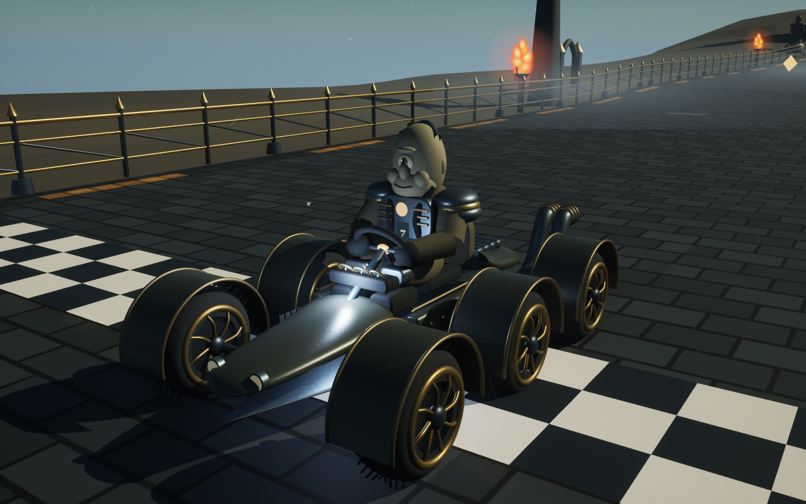
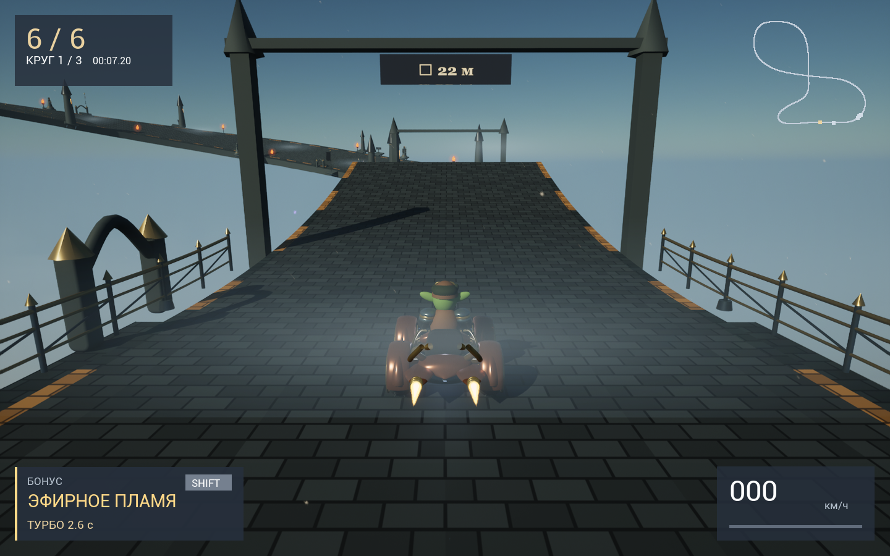

# Wild Drift · The Ashen Covenant — Unreal Engine 5


Нативная версия 0.3 для Apple silicon. В этой папке отдельный C++ проект UE 5.8; браузерная игра в корне репозитория остаётся самостоятельной.

## Запуск из исходников

Нужны Unreal Engine 5.8 и совместимый полный Xcode с компилятором Metal. На машине разработки проверены UE 5.8.2, Xcode 26.1.1 и macOS 26.4.1.

Если `xcrun metal --version` сообщает об отсутствующем Metal Toolchain, установите его командой `xcodebuild -downloadComponent MetalToolchain`.

Из корня репозитория:

```sh
unreal/tools/check-core.sh
node unreal/tools/check-content.cjs
unreal/tools/build.sh
unreal/tools/bootstrap.sh
unreal/tools/run.sh
```

`bootstrap.sh` создаёт настоящие UE материалы и стартовую карту. При наличии `Content/Materials/*.uasset` и `Content/Maps/Covenant.umap` повторять его не требуется. Проект можно открыть в редакторе: `unreal/WildDrift/WildDrift.uproject`, затем нажать Play.

По умолчанию скрипты используют `/Users/Shared/Epic Games/UE_5.8`; для другого расположения задайте `UNREAL_ENGINE_ROOT`.

```sh
UNREAL_ENGINE_ROOT='/путь/к/UE_5.8' unreal/tools/build.sh
```

Для отдельного приложения без установленного редактора:

```sh
unreal/tools/package.sh
```

Результат помещается в `unreal/artifacts`. Готовую сборку для разработки можно запускать локально; распространение с подписью Developer ID и notarization требует аккаунта разработчика Apple.

## Управление

- WASD / стрелки — газ, тормоз и ручной руль.
- Пробел — удерживать для дрифта; отпускание заряженного заноса даёт турбо.
- Shift — использовать предмет; у бросаемого предмета появляется прицел на сопернике впереди.
- C — удерживать для вида назад.
- R — вернуть машину на трассу со штрафом скорости.
- Esc — пауза.
- M — выключить или включить звук.

Восемь фэнтези-гонщиков: гоблин, орк, светлый и тёмный эльфы, человек, дворф, циклоп и тифлинг. У каждого своя особенность и три кузова; доступны пять направлений прокачки. Плащей и хвостов нет.

Пять трасс различаются декорациями и погодой: пепельный ветер, дождливый лес, ледяной серпантин с метелью, кузня с шестернями и искрами, грозовые руины с рунными кольцами. Поперечный уклон до 30° рассчитывается на поворотах и плавно уходит в ноль возле разрывов. Тесные повороты сглажены, чтобы края полотна не пересекались. Подъезды к разрывам имеют плавные профили длиной 36/42 м. Плиты ускорения и стартовая разметка повторяют поверхность дороги. Дальний фон удалён; боковые площадки связывают декорации с дорогой.

Наклон машинки учитывает её направление относительно поверхности; в воздухе следует скорости полёта с ограничением угловой скорости. Коллизии используют выпуклый контур кузова и колёс без увеличенной прямоугольной оболочки; раздвижение работает постоянно, в том числе во время анимации столкновения. В руке показываются только бросаемые предметы, для которых работает прицел с шансом наведения 70%. При турбо огонь появляется в выходах выхлопных труб. Перед стартом можно выбрать от 1 до 10 кругов и от 0 до 8 соперников (до 9 машин вместе с игроком). При 8 соперниках один герой повторяется. В HUD постоянно виден текущий бонус и время активного щита/турбо; прицел отображается только на цели. Всплывающие подсказки во время заезда убраны. После попадания газ работает сразу, эффективность разгона восстанавливается плавно. При отпускании дрифта сцепление возвращается постепенно; боковая сила шин и скорость вращения ограничены на высокой скорости. Очки и опыт сохраняются после финиша; покупки и улучшения — сразу. Рекорды трёхкруговых заездов сохраняют прежний формат; заезды другой длины их не перезаписывают. Прогресс Unreal хранится отдельно от browser localStorage, в `Saved/profile.json` проекта (у упакованного приложения — в пользовательской папке Saved, указанной в журнале игры).






## Устройство и проверки

- `Source/WildDrift/RaceCore.h` — независимая от движка C++ симуляция: 120 шагов в секунду, мировые координаты, боковое скольжение, прыжки, ограждения, попадания, RPG и экономика.
- `AuthoredTracks.h` и `Content/PortData` — трассы, 24 модели, материалы и текстуры; `tools/native-art.cjs` перерабатывает исходную геометрию для нативной версии. Во время игры JavaScript не исполняется.
- `DriftModels.cpp`, `DriftGame.cpp`, `DriftUI.cpp` — геометрия UE, анимации, сцена, эффекты, камера, сохранение, Slate-меню и HUD.
- `tools/check-core.sh` — исполняемая проверка физики, прохождения всех трасс, бросков и покупок без запуска Unreal.
- `node tools/check-content.cjs` — проверка 24 кузовов, восьми новых гонщиков, выхлопных точек, отсутствия плащей/хвостов и дальнего фона.
- `tools/run.sh -WildDriftGallery -unattended -nosound` — снимки восьми гонщиков спереди и сзади.
- `tools/run.sh -WildDriftSmoke -unattended -nosound` — короткий нативный заезд с автоматическим снимком и выходом; результат `WILDDRIFT_SMOKE_OK` в журнале, `Saved/Screenshots/NativeRace.png` в проекте.
- `tools/run.sh -WildDriftVerify -unattended -nosound` — проверка ввода через PlayerController, прицела, броска, паузы, возврата, невидимости пассивных предметов в руке, выхлопа, прыжка/приземления и чтения/записи прогресса. Использует отдельный `verification-profile.json`; Также проверяет отсутствие прицела без цели, одиночный заезд, девять машин и настройки 1/10 кругов; успешный итог — `WILDDRIFT_INPUT_OK`.
- `tools/run.sh -WildDriftSuite -unattended -nosound` — последовательная визуальная проверка пяти трасс и меню с сохранением снимков; итоговая строка `WILDDRIFT_SUITE_OK`.
- `tools/run.sh -WildDriftAutoDrive -WildDriftCourse=2` — просмотр заезда бота; индекс трассы 0–4. В обычной игре управление игрока не автоматизируется.

Для повторного переноса геометрии после изменений web игры: `node unreal/tools/export-content.cjs`. Экспорт использует уже установленный `@napi-rs/canvas`; альтернативный путь задаётся `CANVAS_MODULE`. Экспортированные данные уже лежат в репозитории и не требуют Node для сборки игры.
